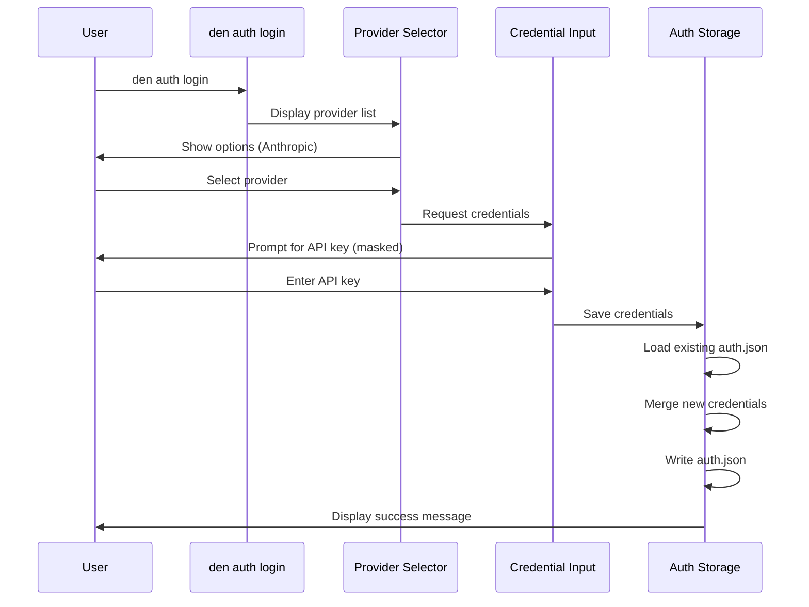

# Design Document: Auth Login Command

## Overview

The `den auth login` command provides a user-friendly way to configure API credentials for external services. The initial implementation supports Anthropic authentication, with an extensible architecture to add more providers. Credentials are stored in a JSON file at `~/.config/den/auth.json`.

## Architecture

The auth system follows a modular design with clear separation of concerns:

```
┌─────────────────────────────────────────────────────────────┐
│                    den auth login                           │
├─────────────────────────────────────────────────────────────┤
│  ┌─────────────┐  ┌─────────────┐  ┌─────────────────────┐  │
│  │  Provider   │  │ Credential  │  │   Auth Storage      │  │
│  │  Selector   │──│   Input     │──│   (auth.json)       │  │
│  └─────────────┘  └─────────────┘  └─────────────────────┘  │
└─────────────────────────────────────────────────────────────┘
```

### Component Flow



## Components and Interfaces

### 1. Auth Command Group (`src/den/commands/auth.py`)

A Typer command group that organizes authentication-related commands.

```python
auth_app = typer.Typer(help="Authentication commands for external services.")

@auth_app.command()
def login() -> None:
    """Log in to an external service by providing credentials."""
```

### 2. Provider Registry

A simple registry pattern for managing available providers:

```python
@dataclass
class Provider:
    name: str
    key_name: str  # Key used in auth.json (e.g., "anthropic_api_key")
    prompt_text: str  # Text shown when prompting for credentials

PROVIDERS: dict[str, Provider] = {
    "Anthropic": Provider(
        name="Anthropic",
        key_name="anthropic_api_key",
        prompt_text="Enter your Anthropic API key",
    ),
}
```

### 3. Auth Storage (`src/den/auth_storage.py`)

Handles reading and writing credentials to the auth.json file:

```python
def get_auth_file_path() -> Path:
    """Return the path to the auth.json file."""

def load_credentials() -> dict[str, str]:
    """Load existing credentials from auth.json."""

def save_credentials(credentials: dict[str, str]) -> None:
    """Save credentials to auth.json, merging with existing."""

def save_credential(key: str, value: str) -> None:
    """Save a single credential, preserving others."""
```

### 4. Main Entry Point Integration

Register the auth command group in `main.py`:

```python
from den.commands.auth import auth_app
app.add_typer(auth_app, name="auth")
```

## Data Models

### Auth Configuration File (`~/.config/den/auth.json`)

```json
{
  "anthropic_api_key": "sk-ant-...",
  "future_provider_key": "..."
}
```

The file uses a flat structure where each key represents a specific credential. This allows easy addition of new providers without schema changes.

### Provider Configuration

```python
@dataclass
class Provider:
    name: str        # Display name for the provider
    key_name: str    # Key used in auth.json
    prompt_text: str # Prompt shown to user
```

## Correctness Properties

*A property is a characteristic or behavior that should hold true across all valid executions of a system-essentially, a formal statement about what the system should do. Properties serve as the bridge between human-readable specifications and machine-verifiable correctness guarantees.*

Based on the prework analysis, the following properties must hold:

### Property 1: Non-empty API key acceptance
*For any* non-empty string provided as an API key, the validation function SHALL accept it as valid input.
**Validates: Requirements 2.3**

### Property 2: Credential merge preserves existing keys
*For any* existing auth.json content and any new credential being saved, the save operation SHALL preserve all existing keys while adding or updating the new key.
**Validates: Requirements 3.4**

### Property 3: Credential serialization round-trip
*For any* valid credentials dictionary, serializing to JSON and deserializing back SHALL produce an equivalent dictionary.
**Validates: Requirements 3.7**

### Property 4: Credential read/write consistency
*For any* credential key-value pair that is saved, reading that key from storage SHALL return the same value that was saved.
**Validates: Requirements 4.2, 4.3**

## Error Handling

| Error Condition | Handling Strategy |
|----------------|-------------------|
| User cancels provider selection | Exit with code 0, no changes |
| User cancels API key input | Exit with code 0, no changes |
| Empty API key entered | Display error, re-prompt |
| Cannot create config directory | Display error with path, exit with code 1 |
| Cannot write auth.json | Display error with details, exit with code 1 |
| Invalid JSON in existing auth.json | Display error, suggest manual fix, exit with code 1 |

## Testing Strategy

### Unit Tests

Unit tests will cover:
- Provider registry contains expected providers
- Validation rejects empty strings
- Success message formatting
- Path construction for auth.json

### Property-Based Tests

Using the `hypothesis` library (already in dev dependencies), property-based tests will verify:

1. **Non-empty API key acceptance**: Generate arbitrary non-empty strings and verify validation passes
2. **Credential merge preservation**: Generate random existing credentials and new credentials, verify merge preserves all keys
3. **Serialization round-trip**: Generate random credential dictionaries, verify JSON round-trip produces equivalent values
4. **Read/write consistency**: Generate random key-value pairs, save and read back, verify equality

Each property test will run a minimum of 100 iterations.

Property tests will be tagged with the format: `**Feature: auth-login, Property {number}: {property_text}**`

### Test File Structure

```
tests/
  test_auth_storage.py      # Storage function tests
  test_auth_properties.py   # Property-based tests for auth
```
