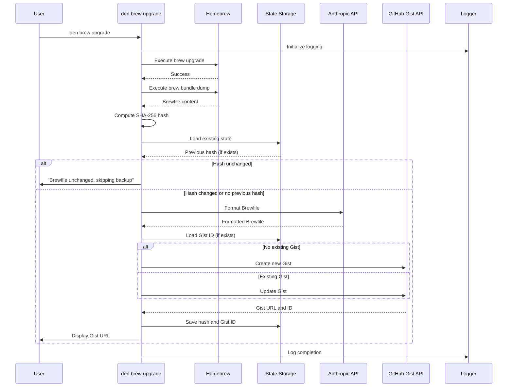

# Design Document: Brew Backup Command

## Overview

The `den brew upgrade` command automates Homebrew maintenance and backup. It executes `brew upgrade` to update packages, generates a Brewfile snapshot, uses Anthropic's API to add documentation and categorization, and backs up the result to a GitHub Gist. The system uses content hashing to detect changes and avoid unnecessary API calls when the Brewfile hasn't changed.

## Architecture

The brew backup system follows a pipeline architecture with clear separation of concerns:

```
┌─────────────────────────────────────────────────────────────────────────────┐
│                         den brew upgrade                                     │
├─────────────────────────────────────────────────────────────────────────────┤
│  ┌──────────┐  ┌──────────┐  ┌──────────┐  ┌──────────┐  ┌──────────────┐  │
│  │  Brew    │  │ Brewfile │  │ Anthropic│  │  GitHub  │  │    State     │  │
│  │ Upgrade  │──│Generator │──│Formatter │──│  Gist    │──│   Storage    │  │
│  └──────────┘  └──────────┘  └──────────┘  └──────────┘  └──────────────┘  │
│       │              │              │             │              │          │
│       └──────────────┴──────────────┴─────────────┴──────────────┘          │
│                                    │                                         │
│                              ┌─────┴─────┐                                   │
│                              │  Logger   │                                   │
│                              └───────────┘                                   │
└─────────────────────────────────────────────────────────────────────────────┘
```

### Component Flow



## Components and Interfaces

### 1. Brew Command Group (`src/den/commands/brew.py`)

A Typer command group for Homebrew-related commands:

```python
brew_app = typer.Typer(help="Homebrew management commands.")

@brew_app.command()
def upgrade(
    force: bool = typer.Option(False, "--force", "-f", help="Force backup even if Brewfile unchanged")
) -> None:
    """Upgrade Homebrew packages and backup Brewfile to GitHub Gist."""
```

### 2. Brew Runner (`src/den/brew_runner.py`)

Handles execution of Homebrew commands:

```python
def run_brew_upgrade() -> None:
    """Execute brew upgrade command."""

def generate_brewfile() -> str:
    """Execute brew bundle dump and return Brewfile content."""
```

### 3. Brewfile Formatter (`src/den/brewfile_formatter.py`)

Handles Anthropic API integration for formatting:

```python
def format_brewfile(raw_content: str, api_key: str) -> str:
    """Send Brewfile to Anthropic for formatting with descriptions."""

def build_formatting_prompt(raw_content: str) -> str:
    """Build the prompt for Anthropic API.
    
    The prompt instructs the AI to:
    - Add a header noting the file was generated by den with brew bundle usage instructions
    - Add inline description comments at the end of each package line
    - Organize packages into categories with decorated section headers (# ============ style)
    - Preserve all original package entries
    """
```

### 4. GitHub Gist Client (`src/den/gist_client.py`)

Handles GitHub Gist API operations:

```python
def create_gist(content: str, token: str, description: str) -> tuple[str, str]:
    """Create a new Gist. Returns (gist_id, gist_url)."""

def update_gist(gist_id: str, content: str, token: str) -> str:
    """Update an existing Gist. Returns gist_url."""

def get_gist_content(gist_id: str, token: str) -> str | None:
    """Retrieve content from an existing Gist."""
```

### 5. State Storage (`src/den/state_storage.py`)

Handles reading and writing application state:

```python
def get_state_file_path() -> Path:
    """Return the path to the state.json file."""

def load_state() -> dict[str, Any]:
    """Load existing state from state.json."""

def save_state(state: dict[str, Any]) -> None:
    """Save state to state.json, merging with existing."""

def get_brew_state() -> dict[str, str] | None:
    """Get the brew-specific state (hash, gist_id)."""

def save_brew_state(brewfile_hash: str, gist_id: str) -> None:
    """Save brew-specific state."""
```

### 6. Hash Utility (`src/den/hash_utils.py`)

Utility for computing content hashes:

```python
def compute_hash(content: str) -> str:
    """Compute SHA-256 hash of content."""
```

### 7. Brew Logger (`src/den/brew_logger.py`)

Configures logging for the brew upgrade process:

```python
def setup_brew_logger() -> logging.Logger:
    """Configure and return logger for brew operations."""

def get_log_file_path() -> Path:
    """Return the path to the brew-upgrade.log file."""
```

### 8. Main Entry Point Integration

Register the brew command group in `main.py`:

```python
from den.commands.brew import brew_app
app.add_typer(brew_app, name="brew")
```

## Data Models

### State File (`~/.config/den/state.json`)

```json
{
  "brew": {
    "brewfile_hash": "sha256:abc123...",
    "gist_id": "abc123def456"
  }
}
```

### Brew State

```python
@dataclass
class BrewState:
    brewfile_hash: str | None
    gist_id: str | None
```

### Log Entry Format

```
2025-01-15 10:30:45 INFO: Updating Homebrew dependencies...
2025-01-15 10:31:02 INFO: Creating Brewfile...
2025-01-15 10:31:03 ERROR: Failed to connect to Anthropic API
```

## Correctness Properties

*A property is a characteristic or behavior that should hold true across all valid executions of a system-essentially, a formal statement about what the system should do. Properties serve as the bridge between human-readable specifications and machine-verifiable correctness guarantees.*

Based on the prework analysis, the following properties must hold:

### Property 1: Hash computation consistency
*For any* string content, computing the SHA-256 hash multiple times SHALL produce the same hash value.
**Validates: Requirements 2.3**

### Property 2: State merge preserves existing keys
*For any* existing state.json content and any new brew state being saved, the save operation SHALL preserve all existing keys while adding or updating the "brew" key.
**Validates: Requirements 5.3**

### Property 3: State serialization round-trip
*For any* valid brew state dictionary, serializing to JSON and deserializing back SHALL produce an equivalent dictionary.
**Validates: Requirements 5.6**

### Property 4: Log entry format compliance
*For any* log entry written by the brew logger, the entry SHALL contain a timestamp and a log level (INFO, ERROR, or WARNING).
**Validates: Requirements 6.3, 6.4**

## Error Handling

| Error Condition | Handling Strategy |
|----------------|-------------------|
| `brew upgrade` fails | Log error, display message, exit with code 1 |
| `brew bundle dump` fails | Log error, display message, exit with code 1 |
| Anthropic API key missing | Display "Run `den auth login` to configure Anthropic", exit with code 1 |
| Anthropic API call fails | Log error with details, display message, exit with code 1 |
| GitHub token missing | Display "Configure GitHub authentication", exit with code 1 |
| GitHub API call fails | Log error with details, display message, exit with code 1 |
| Cannot create log directory | Display error with path, exit with code 1 |
| Cannot write state.json | Log error, display message, exit with code 1 |
| Invalid JSON in state.json | Log error, treat as empty state, continue |

## Testing Strategy

### Unit Tests

Unit tests will cover:
- Brew command execution (mocked subprocess)
- Brewfile generation (mocked subprocess)
- Hash computation for known inputs
- State file path construction
- Log file path construction
- Progress message output
- Error message formatting
- Gist creation/update logic (mocked API)
- Anthropic formatting request (mocked API)

### Property-Based Tests

Using the `hypothesis` library, property-based tests will verify:

1. **Hash computation consistency**: Generate arbitrary strings and verify hash is deterministic
2. **State merge preservation**: Generate random existing state and new brew state, verify merge preserves all keys
3. **State serialization round-trip**: Generate random state dictionaries, verify JSON round-trip produces equivalent values
4. **Log entry format compliance**: Generate random log messages at various levels, verify format includes timestamp and level

Each property test will run a minimum of 100 iterations.

Property tests will be tagged with the format: `**Feature: brew-backup, Property {number}: {property_text}**`

### Test File Structure

```
tests/
  test_brew_command.py       # Command integration tests
  test_brew_runner.py        # Brew execution tests
  test_brewfile_formatter.py # Anthropic formatting tests
  test_gist_client.py        # GitHub Gist API tests
  test_state_storage.py      # State persistence tests
  test_hash_utils.py         # Hash utility tests
  test_brew_logger.py        # Logging tests
  test_brew_properties.py    # Property-based tests
```
