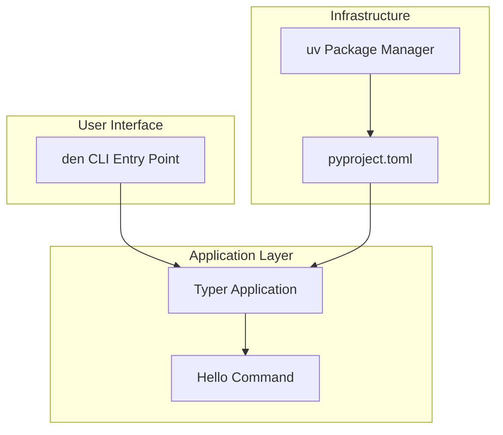
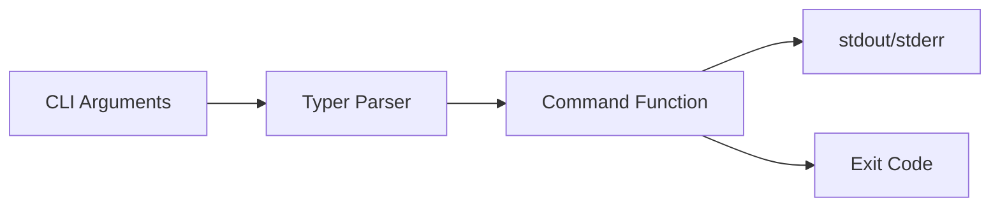

# Design Document: den CLI Application

## Overview

The `den` CLI application is a Python command-line utility built using the Typer framework. It serves as a foundation for local machine automations, starting with a simple "Hello World" command to verify functionality. The project uses modern Python tooling including uv for package management and pyproject.toml for configuration.

## Architecture



The architecture follows a simple layered approach:
- **Entry Point**: The `den` command registered via pyproject.toml scripts
- **Application Layer**: Typer application instance with registered commands
- **Commands**: Individual command modules (starting with hello)

## Components and Interfaces

### 1. Main Application (`src/den/main.py`)

The central Typer application that serves as the command registry.

```python
import typer

app = typer.Typer(
    name="den",
    help="A CLI utility for local machine automations.",
    add_completion=False,
)
```

**Responsibilities:**
- Initialize the Typer application
- Register all command modules
- Handle version display via callback

### 2. Hello Command (`src/den/commands/hello.py`)

The initial command for testing CLI functionality.

```python
def hello(name: str = typer.Option("World", help="Name to greet")) -> None:
    """Say hello to someone."""
    typer.echo(f"Hello, {name}!")
```

**Interface:**
- Input: Optional `--name` parameter (default: "World")
- Output: Greeting message to stdout
- Exit Code: 0 on success

### 3. Package Configuration (`pyproject.toml`)

Defines project metadata, dependencies, and CLI entry point.

**Key Sections:**
- `[project]`: Name, version, description, Python version requirement
- `[project.scripts]`: Maps `den` command to entry point
- `[project.dependencies]`: Runtime dependencies (typer)
- `[project.optional-dependencies]`: Development dependencies (pytest)

## Data Models

This initial implementation has minimal data models. The primary data flow is:



### Greeting Message

The hello command produces a simple string output:
- Format: `"Hello, {name}!"`
- Default name: `"World"`
- Character encoding: UTF-8

## Correctness Properties

*A property is a characteristic or behavior that should hold true across all valid executions of a system-essentially, a formal statement about what the system should do. Properties serve as the bridge between human-readable specifications and machine-verifiable correctness guarantees.*

Based on the prework analysis, the following properties have been identified:

### Property 1: Name greeting format consistency

*For any* valid name string provided to the hello command, the output SHALL contain the exact format "Hello, {name}!" where {name} is the provided input.

**Validates: Requirements 3.2**

### Property 2: Successful execution exit code

*For any* valid invocation of the hello command (with or without the --name option), the command SHALL return exit code 0.

**Validates: Requirements 3.4**

### Property 3: Greeting string round-trip consistency

*For any* greeting message produced by the hello command, serializing the string to bytes (UTF-8) and deserializing back to a string SHALL produce an equivalent value.

**Validates: Requirements 5.5**

## Error Handling

### CLI Argument Errors

Typer handles invalid arguments automatically:
- Unknown options: Display error message and help
- Invalid option values: Display validation error
- Exit code: Non-zero for errors

### Runtime Errors

For this initial implementation, runtime errors are minimal:
- The hello command has no failure modes with valid input
- Future commands should use `typer.Exit(code=1)` for errors
- Error messages should be written to stderr via `typer.echo(..., err=True)`

## Testing Strategy

### Testing Framework

- **Framework**: pytest
- **CLI Testing**: typer.testing.CliRunner
- **Property Testing**: hypothesis

### Dual Testing Approach

Both unit tests and property-based tests will be implemented:

#### Unit Tests

Unit tests verify specific examples and edge cases:

1. **Default hello output**: Verify `den hello` outputs "Hello, World!"
2. **Custom name output**: Verify `den hello --name Alice` outputs "Hello, Alice!"
3. **Help display**: Verify `den --help` shows available commands
4. **Version display**: Verify `den --version` shows version number
5. **Exit codes**: Verify successful commands return exit code 0

#### Property-Based Tests

Property-based tests verify universal properties across all inputs using the hypothesis library:

1. **Property 1 Test**: For any generated string name, the hello command output contains "Hello, {name}!"
   - Tag: `**Feature: den-cli, Property 1: Name greeting format consistency**`
   
2. **Property 2 Test**: For any valid name input, the hello command returns exit code 0
   - Tag: `**Feature: den-cli, Property 2: Successful execution exit code**`

3. **Property 3 Test**: For any greeting string, UTF-8 encode then decode produces the same string
   - Tag: `**Feature: den-cli, Property 3: Greeting string round-trip consistency**`

### Test Configuration

- Minimum 100 iterations per property-based test
- Tests located in `tests/` directory
- Test files follow `test_*.py` naming convention
- Run tests with: `uv run pytest`

### Test File Structure

```
tests/
├── __init__.py
├── test_hello.py      # Unit tests for hello command
└── test_properties.py # Property-based tests
```
