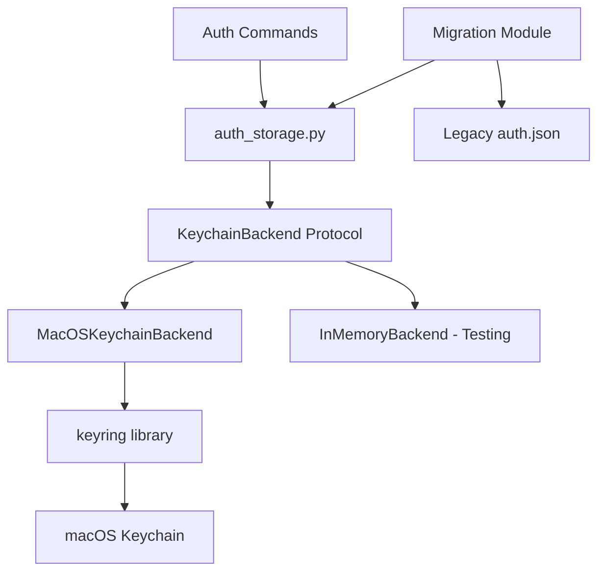

# Design Document: Keychain Storage

## Overview

This design describes the migration of credential storage from an insecure plain-text JSON file (`~/.config/den/auth.json`) to the macOS Keychain. The implementation will use the `keyring` Python library, which provides a cross-platform interface to system credential stores including macOS Keychain.

The design maintains backward compatibility with the existing `auth_storage` module interface while providing secure, encrypted storage for sensitive credentials.

## Architecture



The architecture follows a backend abstraction pattern:
1. **auth_storage.py** - Public API maintaining existing function signatures
2. **KeychainBackend Protocol** - Abstract interface for credential storage backends
3. **MacOSKeychainBackend** - Production implementation using keyring/macOS Keychain
4. **InMemoryBackend** - Test implementation for unit testing without Keychain access

## Components and Interfaces

### KeychainBackend Protocol

```python
from typing import Protocol

class KeychainBackend(Protocol):
    """Protocol defining the interface for credential storage backends."""
    
    def get_credential(self, key: str) -> str | None:
        """Retrieve a credential by key. Returns None if not found."""
        ...
    
    def set_credential(self, key: str, value: str) -> None:
        """Store a credential with the given key."""
        ...
    
    def delete_credential(self, key: str) -> None:
        """Delete a credential by key. No-op if not found."""
        ...
    
    def list_credentials(self) -> list[str]:
        """List all credential keys stored for this service."""
        ...
```

### MacOSKeychainBackend

```python
class MacOSKeychainBackend:
    """Production backend using macOS Keychain via keyring library."""
    
    SERVICE_NAME = "den-cli"
    
    def get_credential(self, key: str) -> str | None:
        """Retrieve credential from Keychain."""
        ...
    
    def set_credential(self, key: str, value: str) -> None:
        """Store credential in Keychain."""
        ...
    
    def delete_credential(self, key: str) -> None:
        """Remove credential from Keychain."""
        ...
    
    def list_credentials(self) -> list[str]:
        """List all credentials for den-cli service."""
        ...
```

### Public API (auth_storage.py)

The existing public functions will be preserved:

```python
def load_credentials() -> dict[str, str]:
    """Load all credentials from Keychain."""
    ...

def save_credentials(credentials: dict[str, str]) -> None:
    """Save multiple credentials to Keychain."""
    ...

def save_credential(key: str, value: str) -> None:
    """Save a single credential to Keychain."""
    ...

def delete_credential(key: str) -> None:
    """Delete a credential from Keychain."""
    ...

def set_backend(backend: KeychainBackend) -> None:
    """Set the storage backend (for testing)."""
    ...
```

### Migration Module

```python
def migrate_from_json() -> bool:
    """Migrate credentials from auth.json to Keychain.
    
    Returns True if migration occurred, False if no migration needed.
    """
    ...

def get_legacy_auth_file_path() -> Path:
    """Return path to legacy auth.json file."""
    ...
```

## Data Models

### Keychain Entry Structure

Each credential is stored as a separate Keychain entry:
- **Service**: `den-cli` (constant for all den credentials)
- **Account**: The credential key (e.g., `github_token`, `anthropic_api_key`)
- **Password**: The credential value (the actual secret)

### Credential Registry

To support `list_credentials()`, a registry entry will track known credential keys:
- **Service**: `den-cli`
- **Account**: `_credential_registry`
- **Password**: JSON array of credential keys (e.g., `["github_token", "anthropic_api_key"]`)


## Correctness Properties

*A property is a characteristic or behavior that should hold true across all valid executions of a system-essentially, a formal statement about what the system should do. Properties serve as the bridge between human-readable specifications and machine-verifiable correctness guarantees.*

Based on the prework analysis, the following correctness properties have been identified:

### Property 1: Credential Round-Trip Consistency

*For any* valid credential key-value pair, saving the credential and then retrieving it SHALL return the exact same value.

**Validates: Requirements 1.1, 1.2**

### Property 2: Delete Removes Credential

*For any* credential that has been saved, deleting it and then attempting to retrieve it SHALL return None.

**Validates: Requirements 1.3**

### Property 3: Bulk Save and Load Consistency

*For any* dictionary of credentials, saving them with `save_credentials` and then calling `load_credentials` SHALL return a dictionary containing all the saved credentials with their exact values.

**Validates: Requirements 2.2, 2.3**

### Property 4: Migration Transfers and Cleans Up

*For any* set of credentials stored in auth.json, running migration SHALL result in all credentials being accessible via the Keychain backend, and the auth.json file SHALL be deleted.

**Validates: Requirements 4.1, 4.2**

### Property 5: Migration Preserves Existing Keychain Credentials

*For any* credential that already exists in the Keychain, migration SHALL NOT overwrite it with a value from auth.json.

**Validates: Requirements 4.4**

## Error Handling

### KeychainAccessError

Raised when the Keychain is unavailable, locked, or access is denied.

```python
class KeychainAccessError(Exception):
    """Raised when Keychain access fails."""
    
    def __init__(self, message: str, original_error: Exception | None = None):
        super().__init__(message)
        self.original_error = original_error
```

### Error Scenarios

| Scenario | Behavior |
|----------|----------|
| Keychain locked | Raise `KeychainAccessError` with message about unlocking Keychain |
| Permission denied | Raise `KeychainAccessError` with guidance on granting access |
| Credential not found | Return `None` (not an error) |
| Invalid credential key | Raise `ValueError` for empty or invalid keys |
| Migration failure | Log warning, preserve auth.json, continue with Keychain |

## Testing Strategy

### Property-Based Testing

The implementation will use **Hypothesis** (already a dev dependency) for property-based testing. Each correctness property will be implemented as a property-based test with a minimum of 100 iterations.

Property tests will use the `InMemoryBackend` to avoid real Keychain access during testing:

```python
class InMemoryBackend:
    """In-memory backend for testing without Keychain access."""
    
    def __init__(self):
        self._store: dict[str, str] = {}
    
    def get_credential(self, key: str) -> str | None:
        return self._store.get(key)
    
    def set_credential(self, key: str, value: str) -> None:
        self._store[key] = value
    
    def delete_credential(self, key: str) -> None:
        self._store.pop(key, None)
    
    def list_credentials(self) -> list[str]:
        return list(self._store.keys())
```

### Test Annotations

Each property-based test will be annotated with:
- `**Feature: keychain-storage, Property {number}: {property_text}**`
- `**Validates: Requirements X.Y**`

### Unit Tests

Unit tests will cover:
- API compatibility with existing `auth_storage` functions
- Error handling for Keychain failures (using mock backend that raises exceptions)
- Migration edge cases (empty auth.json, malformed JSON, partial migration)
- Integration with the `keyring` library (manual/integration tests only)

### Test Configuration

Property-based tests will be configured with:
```python
from hypothesis import settings

@settings(max_examples=100)
```
